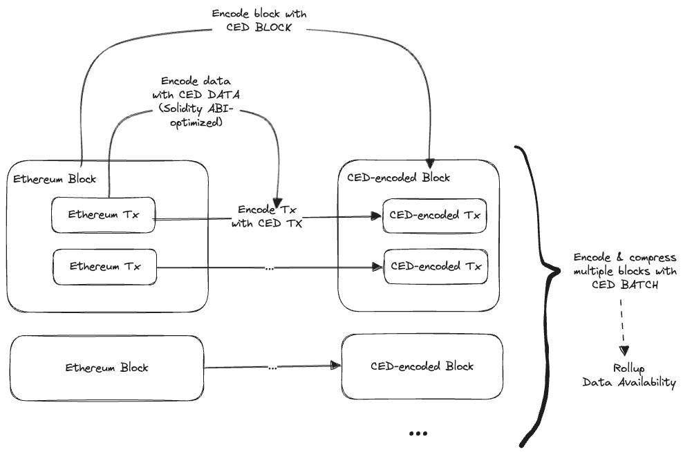
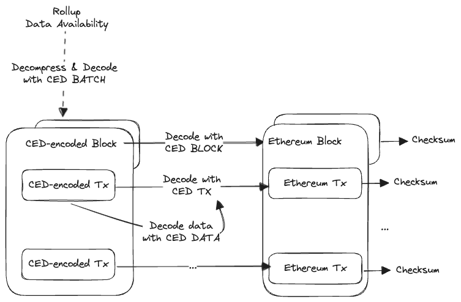

## Abstract

This RIP proposes CED (Compact Ethereum Data), a family of compact encodings much more space-efficient than Solidity ABI-encoded data, RLP-encoded blocks, and transactions. CED encodings also enable more aggressive compression for rollups' data availability needs.

We provide compactness at modular levels from transaction data to batch of blocks. CED users can apply the encodings at any level to increase transaction space, block propagation, and DA performance. Users can compress CED-encoded data with general-purpose lossless compression like `zlib`, `zstd`, and `brotli` for further data saving.

Compressing CED-encoded data already yields better results than compressing current standard formats. Nevertheless, we may propose a built-in compression system for even more performance and fewer external dependencies.

The encoding flow:



The decoding flow:



Finally, CED's decoders and dictionaries are committed to Ethereum L1 to guarantee the decodability of historical data. In the near term, we design CED to be compatible with existing encodings on Ethereum. With EIP-2718, an Ethereum node can track CED decoders and dictionaries in memory to parse and interpret without going through the legacy formats.

## Motivation

Scalability has long been a critical issue that decentralised Blockchains like Ethereum face. As chain traffic grows, so do the transaction fees, making Blockchains impractical for most Internet Applications. While promising solutions like rollups have been proposed, data storage remains a bottleneck for security and throughput. While recent advancements in data availability push the boundary further, we still need much more scalability for Internet-scale applications.

Seeing the inefficiencies of native encodings like RLP and Solidity ABI, we design new compact encodings for each component that are also more compressible in batches. CED will help scale Ethereum and rollups currently bottlenecked by data storage and availability.

## Specification

### CED UINT

Ethereum currently uses standard binary encoding for unsigned integers. In practice, many values (especially token values) have many trailing zeros, making such encoding highly inefficient.

We instead represent unsigned integers in scientific notation, as $10^x * y$.

More specifically, we represent them as `x (5 bits) || sy (3 bits) || y_1 || ... || y_sy`, which supports `x` up to $2^5$ and `y` up to $2^{2^3 * 8} = 2^{64}$. The biggest number CED UINT can represent is $2^{64}$ with up to 32 trailing zeros. When a value cannot be represented, the first CED UINT byte is `0x00`, and the next falls back to RLP. The number 0 itself would be encoded as `0x0100`.

Here is how different encodings perform on the most common `Value`s on Ethereum mainnet.

| Value         | RLP                    | Solidity ABI                                                         | CED UINT |
| ------------- | ---------------------- | -------------------------------------------------------------------- | -------- |
| $10^{16}$     | `0x0E2386F26FC10000`   | `0x000000000000000000000000000000000000000000000000002386F26FC10000` | `0x1101` |
| $4 * 10^{16}$ | `0x0E8E1BC9BF040000`   | `0x000000000000000000000000000000000000000000000000008E1BC9BF040000` | `0x1104` |
| $2 * 10^{17}$ | `0x1002C68AF0BB140000` | `0x00000000000000000000000000000000000000000000000002C68AF0BB140000` | `0x8902` |

Next, we define the behaviour when `sy (3 bits)` is `000`. An easy choice is to declare `y = 1` since $10^x$ is widespread in practice.
However, we observe much more compact results when `x (5 bits)` is used to index into the most common 31 values dictionary.
As `0x00` is taken to fall back to RLP, `00001` indexes the most common value, `00010` indexes the second most, and so on.
We can have specific dictionaries for transaction fields like `Value` and `GasTipCap`, and a general dictionary to fall back on.

CED UINT is essential to rollups that submit compressed data to DA. While trailing zeros look like a pattern to us in decimal, it does not look like one to a binary general-purpose compressor.

---

### CED DATA

CED DATA aims to highly compress transaction `data`, which is typically Solidity ABI encoded `calldata` to smart contracts. Solidity ABI encoding could be much more efficient, but rolling out a new compact version would take time and does not apply to running and audited contracts today. Therefore, as the first step, we design CED DATA to make L2 `data` more compact and scale existing contracts on rollups.

CED DATA starts with a header byte:

- `0x00`: The remaining bytes are encoded naively but efficiently based on the aggressive 0-padding behaviour of Solidity ABI.
- Otherwise, the header indexes up to 255 most common methods. These method ids and function argument structures are put in the dictionary to erase many overhead bytes.

TODO: Optionally, we can encode the data structure into CED DATA for more compressibility. We can easily use a header bit to indicate whether the payload has an inline structure.

---

#### `0x00`: General Purpose

The raw `data` is encoded as concatenated byte chunks. Each chunk starts with a header byte:

- `0x00`: The next byte encodes how many `0x00` bytes are in the chunk.
- Otherwise: It is the number of the following bytes that belong to the chunk.

For instance, the following Uniswap payload can be efficiently encoded from 608 bytes:

```
Function: execute(bytes commands,bytes[] inputs,uint256 deadline)

MethodID: 0x3593564c
[0]:  0000000000000000000000000000000000000000000000000000000000000060
[1]:  00000000000000000000000000000000000000000000000000000000000000a0
[2]:  0000000000000000000000000000000000000000000000000000000065a74ea3
[3]:  0000000000000000000000000000000000000000000000000000000000000002
[4]:  080c000000000000000000000000000000000000000000000000000000000000
[5]:  0000000000000000000000000000000000000000000000000000000000000002
[6]:  0000000000000000000000000000000000000000000000000000000000000040
[7]:  0000000000000000000000000000000000000000000000000000000000000160
[8]:  0000000000000000000000000000000000000000000000000000000000000100
[9]:  0000000000000000000000000000000000000000000000000000000000000002
[10]: 000000000000000000000000000000000000000050c783eb9b5c85f2a8000000
[11]: 000000000000000000000000000000000000000000000000025766ce4f5ab1e5
[12]: 00000000000000000000000000000000000000000000000000000000000000a0
[13]: 0000000000000000000000000000000000000000000000000000000000000001
[14]: 0000000000000000000000000000000000000000000000000000000000000002
[15]: 0000000000000000000000005c99a6c14f8dc0c2c3655c64a2cef68ff9f771ba
[16]: 000000000000000000000000c02aaa39b223fe8d0a0e5c4f27ead9083c756cc2
[17]: 0000000000000000000000000000000000000000000000000000000000000040
[18]: 0000000000000000000000000000000000000000000000000000000000000001
[19]: 00000000000000000000000000000000000000000000000002516d3f4868b2c1
```

Down to 147 bytes (~4 times smaller):

```
0x043593564c001f0160001f01a0001c0465a74ea3001f0302080c003d0102001f0140001e020160001e01010020010200140950c783eb9b5c85f2a8001b08025766ce4f5ab1e5001f01a0001f0101001f0102000c145c99a6c14f8dc0c2c3655c64a2cef68ff9f771ba000c14c02aaa39b223fe8d0a0e5c4f27ead9083c756cc2001f0140001f010100180802516d3f4868b2c1
```

TODO: Design a more sophisticated encoding for the `0x00` general purpose case. For instance, we can run an iteration to first find and encode `CED UINT` values in 2 bytes each.

---

#### `0x01`: ERC-20 `transfer`/`0xa9059cbb`

ERC-20 token transfers are today's most common smart contract method (~24% of all Ethereum mainnet transactions). An ERC-20 transfer `data` looks like this:

```
Function: transfer(address \_to, uint256 \_value)

MethodID: 0xa9059cbb
[0]: 000000000000000000000000a28265429c3d0777d3fa812626a5976af0815aaa
[1]: 000000000000000000000000000000000000000000000000000000018b2ba06b
```

We encode the `data` as `0x01 || 20 address bytes || CED UINT`.
We can save 41 bytes (~40%) from the above example with this much more compact encoding:

```
0x01a28265429c3d0777d3fa812626a5976af0815aaa05018b2ba06b
```

---

#### `0x02`: ERC-20 `approve`/`0x095ea7b3`

ERC-20 token approvals are today's second most common smart contract method (~6% of all Ethereum mainnet transactions).

```
Function: approve(address spender, uint256 amount)

MethodID: 0x095ea7b3
[0]: 0000000000000000000000005550d13389bb70f45fcef58f19f6b6e87f6e747d
[1]: 000000000000000000000000000000000000000000000c8caa7941b235a00767
```

We encode the `data` as `0x02 || 20 address bytes || CED UINT`.

TODO: Put more common ERC/EIP/dApp methods into the dictionary.

---

### CED TX

A CED-encoded transaction can be decoded losslessly back into an RLP-encoded Ethereum transaction.

#### Legacy Tx

TODO: We should not prioritise this as few are still using it.

#### Access List Tx

TODO: We do not need to prioritise this as it is unpopular.

#### Dynamic Fee Tx (EIP-1559)

We start with EIP-1559 transactions as they are the dominant type and pave the structure for new transaction types like Proto-Danksharding (EIP-4844).

An EIP-1559 transaction looks like this:

```
TxHash = keccak(TxType=0x02 || RLP(ChainId, Nonce, GasTipCap, GasFeeCap, Gas, To, Value, Data, AccessList, V, R, S))
```

We notice several inefficiencies in the current encoding:

- `TxType` and `ChainId` are semi-static and can be put in a dictionary.
- Storing `GasTipCap` and `GasFeeCap - GasTipCap` is more space efficient than storing both.
- `GasTipCap`, `GasFeeCap`, `Gas`, and `Value` typically have many trailing zeros, which is inefficient to store in raw binary.
- Common `To` addresses can be put in a dictionary.
- `Data` and `AccessList` are constants for pure transfer transactions (~31% of all transactions). We can compress these 2 bytes into a 1-bit flag in the CED TX header.
- `V` can be compressed into a 1-bit flag in the CED TX header per EIP-155.
- We can remove at least 5 bytes of RLP overheads (unused payload length and fixed lengths for `To`, `R`, and `S`), more as we compress integers.

We then define our CED TX encoding as follows (ordering is not final):

```
TxHeader || R || S || To || Nonce || GasTipCap || GasFeeCap - GasTipCap || Gas || Value (|| Data || AccessList)?
```

- The `TxHeader` is at least one byte:
  - The first 5 bits represent the `TxHeader` index in the CED TX header dictionary.
  - When the first 5 bits are `11111`, the next 3 bits denote how many next bytes will represent the (larger) `TxHeader` index.
  - Otherwise, the next 3 bits represent `isPureTransfer`, `useToDict`, and `v`.
- `R` and `S` are raw ECDSA signature values at 32 bytes each.
- When `useToDict` is `1`, `To` is represented by a single byte, the index in the `To` dictionary. Otherwise, it is the raw 20 bytes `To` address.
- `Nonce` is encoded like RLP -- a byte array prefixed by its length.
- `GasTipCap`, `GasFeeCap - GasTipCap`, `Gas`, and `Value` are encoded with CED UINT.
- When `isPureTransfer` is `1`, `Data` and `AccessList` are omitted at the end of the payload.

The `TxHeader` dictionary:
| Bits | `TxType` | `ChainId` | `len(To)` | `len(R)` | `len(S)`
|---|---|---|---|---|---|
| `00000` | 2 | 1 | 20 | 32| 32 |

<details>
<summary>
The top-popular-values dictionaries from 120,000 recent Ethereum mainnet transactions (will change as these are dynamic in nature).
</summary>

The most popular `To` addresses:

```
dac17f958d2ee523a2206206994597c13d831ec7
3fc91a3afd70395cd496c647d5a6cc9d4b2b7fad
a0b86991c6218b36c1d19d4a2e9eb0ce3606eb48
bdfe68ad02797fe4e32ad721280095d77e85c5b8
150674dc6423111055cfba1c5430af9c0c9444b0
7a250d5630b4cf539739df2c5dacb4c659f2488d
c02aaa39b223fe8d0a0e5c4f27ead9083c756cc2
80a64c6d7f12c47b7c66c5b4e20e72bc1fcd5d9e
3328f7f4a1d1c57c35df56bbf0c9dcafca309c49
def1c0ded9bec7f1a1670819833240f027b25eff
881d40237659c251811cec9c364ef91dc08d300c
00000000000000adc04c56bf30ac9d3c0aaf14dc
e47bb08ff23bed7e5c67739c2d420b40188c6961
28c6c06298d514db089934071355e5743bf21d60
1111111254eeb25477b68fb85ed929f73a960582
29469395eaf6f95920e59f858042f0e28d98a20b
b2ecfe4e4d61f8790bbb9de2d1259b9e2410cea5
a9d1e08c7793af67e9d92fe308d5697fb81d3e43
95ad61b0a150d79219dcf64e1e6cc01f0b64c4ce
974caa59e49682cda0ad2bbe82983419a2ecc400
514910771af9ca656af840dff83e8264ecf986ca
51c72848c68a965f66fa7a88855f9f7784502a7f
31f648572b67e60ec6eb8e197e1848cc5f5558de
6b75d8af000000e20b7a7ddf000ba900b4009a80
0000000000a39bb272e79075ade125fd351887ac
808d0aee8db7e7c74faf4b264333afe8c9ccdba4
a69babef1ca67a37ffaf7a485dfff3382056e78c
077d360f11d220e4d5d831430c81c26c9be7c4a4
7e6f60e237c34307d516ef80218c2b04bccbca40
689b6828c30733254b9180607751175dc481b11b
a0425d71cb1d6fb80e65a5361a04096e0672de03
fd14567eaf9ba941cb8c8a94eec14831ca7fd1b4
c36442b4a4522e871399cd717abdd847ab11fe88
096f33453141deb2b58247741c1a086a9bf89f8a
a24787320ede4cc19d800bf87b41ab9539c4da9d
6b175474e89094c44da98b954eedeac495271d0f
80c67432656d59144ceff962e8faf8926599bcf8
6f1cdbbb4d53d226cf4b917bf768b94acbab6168
7d1afa7b718fb893db30a3abc0cfc608aacfebb0
d3ec19bbae51b94c67fc63de88426191a000d29f
6131b5fae19ea4f9d964eac0408e4408b66337b5
f3de3c0d654fda23dad170f0f320a92172509127
3fda25f27211a138adf211f4c060f2149674be6d
41e29c02713929f800419abe5770faa8a5b4dadc
cac0f1a06d3f02397cfb6d7077321d73b504916e
c662c410c0ecf747543f5ba90660f6abebd9c8c4
388c818ca8b9251b393131c08a736a67ccb19297
cbd6832ebc203e49e2b771897067fce3c58575ac
1c479675ad559dc151f6ec7ed3fbf8cee79582b6
f19308f923582a6f7c465e5ce7a9dc1bec6665b1
f653d108cb88aa13e1c366eb4ca1da8c03024ea8
5a98fcbea516cf06857215779fd812ca3bef1b32
e4edb277e41dc89ab076a1f049f4a3efa700bce8
98c3d3183c4b8a650614ad179a1a98be0a8d6b8e
daf1695c41327b61b9b9965ac6a5843a3198cf07
d19d4b5d358258f05d7b411e21a1460d11b0876f
def171fe48cf0115b1d80b88dc8eab59176fee57
90001c357a484e543c6cc4b31cecacb73c1f378d
75e89d5979e4f6fba9f97c104c2f0afb3f1dcb88
ae7ab96520de3a18e5e111b5eaab095312d7fe84
f89d7b9c864f589bbf53a82105107622b35eaa40
d8912c10681d8b21fd3742244f44658dba12264e
bd0fccdc19bc3b979e8e256b7b88aae7c77a5bec
9118f701d05da88aa49af3a4e3366b4f537709fe
cb83ca9633ad057bd88a48a5b6e8108d97ad4472
5f65f7b609678448494de4c87521cdf6cef1e932
2260fac5e5542a773aa44fbcfedf7c193bc2c599
d1d2eb1b1e90b638588728b4130137d262c87cae
ff00000000000000000000000000000000008453
9cf70f0aa9a682f6e498e78ebba7e1bc5f3075dd
5e809a85aa182a9921edd10a4163745bb3e36284
a13baf47339d63b743e7da8741db5456dac1e556
b517850510997a34b4ddc8c3797b4f83fad510c4
253553366da8546fc250f225fe3d25d0c782303b
e28b3b32b6c345a34ff64674606124dd5aceca30
9008d19f58aabd9ed0d60971565aa8510560ab41
4d224452801aced8b2f0aebe155379bb5d594381
b8901acb165ed027e32754e0ffe830802919727f
d37bbe5744d730a1d98d8dc97c42f0ca46ad7146
0439e60f02a8900a951603950d8d4527f400c3f1
3c11f6265ddec22f4d049dde480615735f451646
e8cfad4c75a5e1caf939fd80afcf837dde340a69
787b8840100d9baadd7463f4a73b5ba73b00c6ca
4a220e6096b25eadb88358cb44068a3248254675
5f6ae08b8aeb7078cf2f96afb089d7c9f51da47d
a4e5961b58dbe487639929643dcb1dc3848daf5e
5115d77cdf939a81d8b5da533ff22e0b586749f1
a7efae728d2936e78bda97dc267687568dd593f3
c944e90c64b2c07662a292be6244bdf05cda44a7
6de037ef9ad2725eb40118bb1702ebb27e4aeb24
6982508145454ce325ddbe47a25d4ec3d2311933
d1bcccc2c316d9eece9d5bf65c9caf1273bad11a
32400084c286cf3e17e7b677ea9583e60a000324
1f9840a85d5af5bf1d1762f925bdaddc4201f984
e0e8b73c09c33be31295146a25e80a07f2b2b021
902f09715b6303d4173037652fa7377e5b98089e
ff00000000000000000000000000000000000010
6719c6ebf80d6499ca9ce170cda72beb3f1d1a54
5d22045daceab03b158031ecb7d9d06fad24609b
ac88a0028d7efbe4b0f43adea5ac0f29e50af2a5
0e58e8993100f1cbe45376c410f97f4893d9bfcd
718065195a4ac475706b91d100b7e67e9a58649d
e592427a0aece92de3edee1f18e0157c05861564
81153f0889ab398c4acb42cb58b565a5392bba95
d6b9deb538a98af66e10e5991d3d609d2f56bdf0
1231deb6f5749ef6ce6943a275a1d3e7486f4eae
00000000000000000000000000000000000face7
d56e4eab23cb81f43168f9f45211eb027b9ac7cc
06450dee7fd2fb8e39061434babcfc05599a6fb8
4e5b2e1dc63f6b91cb6cd759936495434c7e972f
0f51bb10119727a7e5ea3538074fb341f56b09ad
1776e1f26f98b1a5df9cd347953a26dd3cb46671
f8ebf4849f1fa4faf0dff2106a173d3a6cb2eb3a
2ec705d306b51e486b1bc0d6ebee708e0661add1
7321ac264b89254ea749a0657d41a9a2ebf8e3da
f57e7e7c23978c3caec3c3548e3d615c346e79ff
74232704659ef37c08995e386a2e26cc27a8d7b1
3fd0910163569fa1498e3b9cbf720bc53f3e8cb5
0ab6a6fb4c0f7130e568a5401f86cf16ab4f7dc0
00000000a991c429ee2ec6df19d40fe0c80088b8
64bc2ca1be492be7185faa2c8835d9b824c8a194
881d4032abe4188e2237efcd27ab435e81fc6bb1
308861a430be4cce5502d0a12724771fc6daf216
5550d13389bb70f45fcef58f19f6b6e87f6e747d
596a5cd859ad53fec23cd3fcd77522f0b407920d
aea46a60368a7bd060eec7df8cba43b7ef41ad85
46950ba8946d7be4594399bcf203fb53e1fd7d37
5c7bcd6e7de5423a257d81b442095a1a6ced35c5
7058eb8d4dd86271b0802a225aafa36b47512603
5283d291dbcf85356a21ba090e6db59121208b44
d5b0f341cb6db2a8022e1e1c13dc4404870a510c
92d6c1e31e14520e676a687f0a93788b716beff5
bf94f0ac752c739f623c463b5210a7fb2cbb420b
1522900b6dafac587d499a862861c0869be6e428
48ec5560bfd59b95859965cce48cc244cfdf6b0c
3a23f943181408eac424116af7b7790c94cb97a5
3999d2c5207c06bbc5cf8a6bea52966cabb76d41
264bd8291fae1d75db2c5f573b07faa6715997b5
767c8bb1574bee5d4fe35e27e0003c89d43c5121
503828976d22510aad0201ac7ec88293211d23da
73bce791c239c8010cd3c857d96580037ccdd0ee
ffa397285ce46fb78c588a9e993286aac68c37cd
f411903cbc70a74d22900a5de66a2dda66507255
6c6c58e832adfdbdd800f7d57acd0be4382511d2
10cc48eb048a49301816e2a5d3c12ece9739020e
2bcb6bc69991802124f04a1114ee487ff3fad197
5050e08626c499411b5d0e0b5af0e83d3fd82edf
cffad3200574698b78f32232aa9d63eabd290703
3b002ffeb716735057641cb5389ed45cfd39111b
3845badade8e6dff049820680d1f14bd3903a5d0
3ee18b2214aff97000d974cf647e7c347e8fa585
87870bca3f3fd6335c3f4ce8392d69350b4fa4e2
5954ab967bc958940b7eb73ee84797dc8a2afbb9
ce16f69375520ab01377ce7b88f5ba8c48f8d666
25b4f5d4c314bcd5d7962734936c957b947cb7cf
24befd3717862845643f18096c4e05e664ed823d
71660c4005ba85c37ccec55d0c4493e66fe775d3
9f8f72aa9304c8b593d555f12ef6589cc3a579a2
f8b1378579659d8f7ee5f3c929c2f3e332e41fd6
a5e38d098b54c00f10e32e51647086232a9a0afd
490bd56dbe82fbb8f3eb5c8ff611ab40313daca5
68b3465833fb72a70ecdf485e0e4c7bd8665fc45
00000000007767d79f9f4aa1ff0d71b8e2e4a231
5faa989af96af85384b8a938c2ede4a7378d9875
c3ca38091061e3e5358a52d74730f16c60ca9c26
49048044d57e1c92a77f79988d21fa8faf74e97e
111111111117dc0aa78b770fa6a738034120c302
0265994914d6f92bc36c7f494007a979144006da
f3b0073e3a7f747c7a38b36b805247b222c302a3
ee7f2d8257aa658c5895796f070e4046ba8fb37e
88fb1aa7dbc5ed7f48371ded2656483fd10c0b41
d5fbda4c79f38920159fe5f22df9655fde292d47
abea9132b05a70803a4e85094fd0e1800777fbef
a49cd0310edfe44cb2f48a2c4bfb7ef3087f6950
1689a089aa12d6cbbd88bc2755e4c192f8702000
b50721bcf8d664c30412cfbc6cf7a15145234ad1
8d1f2ebfaccf1136db76fdd1b86f1dede2d23852
14fee680690900ba0cccfc76ad70fd1b95d10e16
b4357054c3da8d46ed642383f03139ac7f090343
d198fbe60c49d4789525fc54567447518c7d2a11
602c90d796d746b97a36f075d9f3b2892b9b07c2
9cb4706e20a18e59a48ffa7616d700a3891e1861
3cce423604205e53b148a87254038c55756b8838
00000000009e50a7ddb7a7b0e2ee6604fd120e49
1111111254fb6c44bac0bed2854e76f90643097d
d533a949740bb3306d119cc777fa900ba034cd52
000000000dfde7deaf24138722987c9a6991e2d4
d7f721e05546a961386ee5c32192ea40b86c0120
628a3b2e302c7e896acc432d2d0dd22b6cb9bc88
df1a7688edc70dc795025bdce7e49ed262870790
df48fad6bef4e94aabc2d479c17b4788f5cf10d4
1ef1b6bb65cc49c3819ec9f2053000984cd7beb7
a53d80cd5e4647dcd5d09c8455b049adcf8f4361
4a836ef6c129a2c96cae42fa367c7d229c5ea802
4675c7e5baafbffbca748158becba61ef3b0a263
a0c68c638235ee32657e8f720a23cec1bfc77c77
2b591e99afe9f32eaa6214f7b7629768c40eeb39
95fc37a27a2f68e3a647cdc081f0a89bb47c3012
9d6695f4b4d7365df3cb83dff098601a4a163db5
72c60bfffef18dca51db32b52b819a951b6ddbed
059956483753947536204e89bfad909e1a434cc6
4945ce2d1b5bd904cac839b7fdabafd19cab982b
000000d40b595b94918a28b27d1e2c66f43a51d3
a4084b46f01d518616b0cdcc557b7f7e0cf8bd50
f3f04555f8fda510bfc77820fd6eb8446f59e72d
634847d6b650b9f442b3b582971f859e6e65eb53
bded8a4dc74a940eab68703167db89b1712b68ea
68a47fe1cf42eba4a030a10cd4d6a1031ca3ca0a
e8b862a2b0ae4c5e01329f6cb284bcd9c3a47874
4e15361fd6b4bb609fa63c81a2be19d873717870
7c195d981abfdc3ddecd2ca0fed0958430488e34
df3288f9e54809c97edabdeb8f0c3c26ce0f5192
0000000000c2d145a2526bd8c716263bfebe1a72
767fe9edc9e0df98e07454847909b5e959d7ca0e
d1742b3c4fbb096990c8950fa635aec75b30781a
423f4e6138e475d85cf7ea071ac92097ed631eea
186ef81fd8e77eec8bffc3039e7ec41d5fc0b457
554e43143b3a28518db6d944e74fffd4751743b1
7fc66500c84a76ad7e9c93437bfc5ac33e2ddae9
3005003bda885dee7c74182e5fe336e9e3df87bb
5db209f7f4cbd7011b486b8d99e5ae616947a138
92e929d8b2c8430bcaf4cd87654789578bb2b786
c00e94cb662c3520282e6f5717214004a7f26888
d588b586d61c826a0e87919b3d1a239206d58bf2
6f985529c239071bff247f13793be104e4388d9e
889edc2edab5f40e902b864ad4d7ade8e412f9b1
69af81e73a73b40adf4f3d4223cd9b1ece623074
0096913d68a000311266250f0000000000e04c00
62d3c05b9c3d916fbc111819bbd3cee52906c1ae
d74cf5c71c76837f523c229441274c1ad84fcd46
57b946008913b82e4df85f501cbaed910e58d26c
e3cbd06d7dadb3f4e6557bab7edd924cd1489e8f
77696bb39917c91a0c3908d577d5e322095425ca
39da41747a83aee658334415666f3ef92dd0d541
8571c129f335832f6bbc76d49414ad2b8371a422
a0ef786bf476fe0810408caba05e536ac800ff86
4dbd4fc535ac27206064b68ffcf827b0a60bab3f
f955c57f9ea9dc8781965feae0b6a2ace2bad6f3
3819f64f282bf135d62168c1e513280daf905e06
3c3a81e81dc49a522a592e7622a7e711c06bf354
c10b7623dd8c7a4092c24d50da2a92d864464c1a
62d0a8458ed7719fdaf978fe5929c6d342b0bfce
3506424f91fd33084466f402d5d97f05f8e3b4af
3a9b61d1dd04b9732b5e51df6d4c87b172268da8
edaa2fa0fd153b78efde805b0a46225bb95e3ca1
9168765ee952de7c6f8fc6fad5ec209b960b7622
10374bc1c4ca086e22673dbc4d702fee74c4ffc5
d1669ac6044269b59fa12c5822439f609ca54f41
f951e335afb289353dc249e82926178eac7ded78
8edf7d0ced8cd7557c8eefb928d3c2d44c87d429
1a8f43e01b78979eb4ef7febec60f32c9a72f58e
a0b73e1ff0b80914ab6fe0444e65848c4c34450b
ec2432a227440139ddf1044c3fea7ae03203933e
d9b3c5404492694f3251e40276c1a402c8684ea6
0f5d2fb29fb7d3cfee444a200298f468908cc942
2c2c82e7caf5f14e4995c366d9db8cdfdf7677e3
```

The most popular `GasTipCap` values:

```
100000000
2000000000
1000000000
300000000
11300000
3000000000
10000000
1500000000
50000000
90000000
5000000000
500000000
2500000000
10000000000
2001000000
80000000
200000000
2200000000
99000000
115000000
3002000000
16950000
56500000
15000000000
20000000000
400000000
69280170
713690000
630000000
150000000
610610384
```

The most popular `GasFeeCap - GasTipCap` values:

```
0
100000000000
19801529400
39971891931
149900000000
22000000000
26000000000
40177310679
19700689603
31000000000
48000000000
33000000000
45000000000
25901000000
30000000000
95000000000
25000000000
44000000000
24000000000
99000000000
32000000000
57000000000
38000000000
47000000000
34000000000
39000000000
28000000000
28290000000
49000000000
499983050000
40000000000
```

The most popular `GasFeeCap` values:

```
21000
207128
90000
100000
35001
84000
500000
220436
158171
50000
120000
70000
60000
80000
1000000
200000
22000
150000
25200
210000
94813
300000
420000
55000
105000
31500
146004
155620
250000
69163
200001
```

The most popular `Value`s:

```
100000000000000000
10000000000000000
50000000000000000
200000000000000000
20000000000000000
40000000000000000
500000000000000000
1000000000000000000
5000000000000000
30000000000000000
150000000000000000
250000000000000000
300000000000000000
400000000000000000
1000000000000000
15000000000000000
60000000000000000
80000000000000000
2000000000000000000
25000000000000000
7000000000000000
4000000000000000
2000000000000000
45000000000000000
18000000000000000
90000000000000000
3000000000000000
120000000000000000
70000000000000000
6000000000000000
3000000000000000000
```

</details>

#### Blob Tx

TODO: We do not need to prioritise this as EIP-4844 has not officially gone LIVE.

---

### CED BLOCK

TODO: We can work on this next to compress Ethereum and rollup blocks better, especially with signature aggregation.

---

### CED BATCH

TODO: After finalising CED BLOCK, we can start working on this and specific-purpose compression algorithms (like encoding with a fine-tuned global dictionary, grouping by similar transactions, delta coding sorted elements, and more). A batch can be a batch of blocks or a batch of transactions. We may also consider calling this CED ARCHIVE instead.

### Versioning & On-chain Commitments

TODO: It is critical to have a robust versioning system with the decoder and dictionaries committed to Ethereum L1 per version. The goal is to ensure the decodability of historical data, the verification of encoding signers, and the flexibility to evolve with new Ethereum standards. Nevertheless, we can delay the design decision until the encodings get closer to production-ready. For now, aggressive experiments and benchmarking are much more critical.

---

## Rationale

Ethereum data, transactions, and blocks can be encoded much better than with RLP and Solidity ABI.

## Backwards Compatibility

In the near term, we design CED to be compatible with existing encodings on Ethereum. With EIP-2718, an Ethereum node can track CED decoders and dictionaries in memory to parse and interpret without going through the legacy formats.

## Test Cases

We first tested the CED DATA & TX encodings on 120,000 recent transactions on the Ethereum mainnet. Early results are rather promising.


(\*) Compressed shows the best average result after compressing raw transactions between `zstd` and `brotli`.

At the least, applying CED encodings will improve (L1 & L2) nodes' transaction submission bandwidth, mempool and local storage.

We expect much more improvement for rollup's DA batches as we introduce CED BLOCK, BATCH (with signature aggregation), and our specific-purpose compression algorithms.

## Reference Implementation

TODO: We are using TypeScript and Python for rapid prototyping and benchmarking. We will eventually provide a reference implementation in Go and C for performance and ease of integration into Ethereum and rollup nodes.

## Security Considerations

TODO: For now, we minimise attack vectors by ensuring CED encodings are compatible with existing Ethereum standards and only used for storage and communication. Regardless, we need to ensure the decoders are not prone to DOS attacks, the dictionaries are properly committed and verified, and more.

## Copyright

Copyright and related rights waived via [CC0](../LICENSE.md).

## Roadmap

1. Ask experts for the first round of review.
2. Try more improvements for CED TX & DATA.
3. A second draft with CED BLOCK & CED BATCH (with signature aggregation).
4. A third draft with CED compression.
5. Seek more ideas and experiment with more encodings and compression algorithms!
6. Provide reference implementations.
7. Security audits.

### CED Data

- Design a more sophisticated encoding for the `0x00` general purpose case.
- Define more common methods in the dictionary.
- Optionally encode the data structure into CED DATA for more compressibility.

### CED TX

- Support Legacy, Access List, and Blob transactions.
- Consider removing `Nonce` from rollup transactions as it can be recalculated from rollup states. Generally, we can use a header bit to indicate the inclusion of `Nonce` in a transaction.
- Consider another encoding for values (on top of `CED UINT`) in steps of powers of two.
- More benchmarks with more transactions.
- Use a header bit for the sign of `S - R`, then encode `S` as `abs(R - S)` to lower the `S` values.
- Find ways to exploit the fact that `S` & `R` are modulo of, hence smaller than `0xFFFFFFFFFFFFFFFFFFFFFFFFFFFFFFFEBAAEDCE6AF48A03BBFD25E8CD0364141`.
- Try Elias-Fano encoding for even more compact integers.
- Try re-arranging field positions in the encoding. We should rationalise the optimal ordering based on logic and data.
- For batching, we can sort transactions by `R` (inserting an extra index as metadata) for delta encoding across transactions. The goal is to "narrow down" the massive $2^{256}$ space of `S` and `R`. We would need much testing as the (small) gain may not justify the extra index and complexity.
- For Satanists: Erase bits from `S` and let the decoders brute force them back during decoding.
- [Compressed ecdsa signatures](https://patents.google.com/patent/US20100023775A1/en).
- [TurboPFor-Integer-Compression](https://github.com/powturbo/TurboPFor-Integer-Compression).
